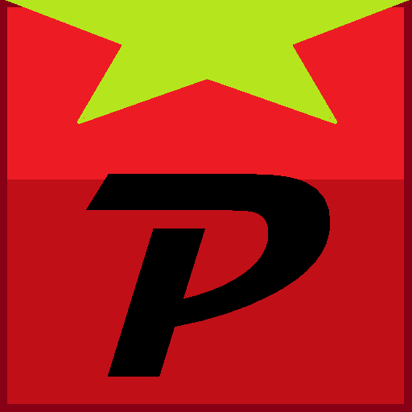
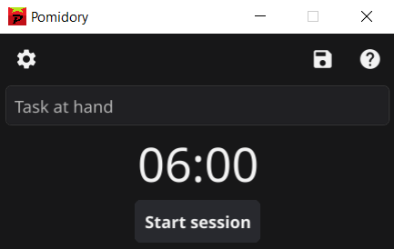
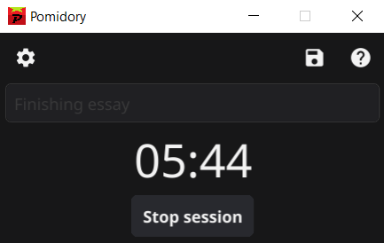

#  Pomidory
This application is created to help you with the pomodoro technique. In the late 1980's Francesco Cirillo developed 
this technique to help him work more efficiently. 

## Usage
Navigate to the 'binary' folder, and fire up the corresponding executable for your system. There is 
one for Windows and Mac OS.

## Development
Pomidory is written in Golang, with the use of [Fyne](https://fyne.io/). I've developed this program 
on Windows using Go 1.21.0 and Fyne 2.4.0. Fyne requires some extra work while setting up, more 
information about this can be [found here](https://developer.fyne.io/started/#prerequisites).

## Screenshots

## License
This application is GPL2 licensed. See LICENSE.
